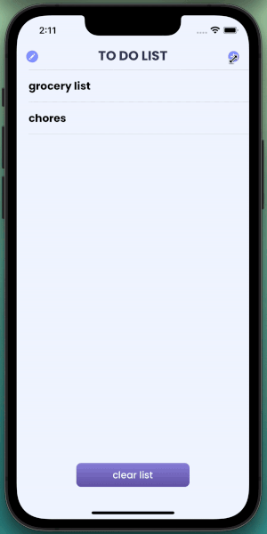
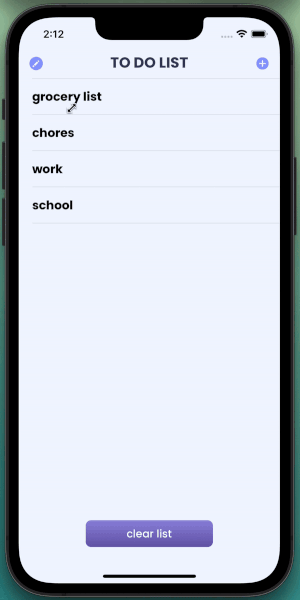
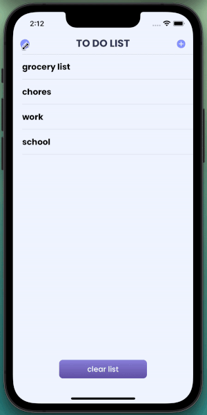
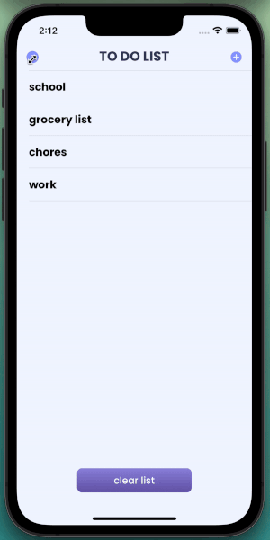
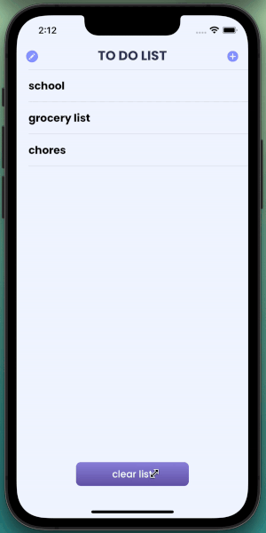

# to do list app
simple to do list app that includes add, edit, & delete functionality.

## set up directions
### downloading the zip file
1. Make sure XCode is installed on your computer
2. Download the zip file by going to **Code** in the top right corner, and click **Download ZIP**
3. Unzip the file
4. Open up XCode
5. Build & run the project

### clone the git
1. Make sure XCode is installed on your computer
2. Open up your terminal
3. Go to the directory/folder you would like to clone the project to
4. Type `git clone` + HTTPS link provided in **Code** in the top right corner
5. Open up XCode
6. Build & run the project

## create task

## update task

## move task

## delete task

## clear task list

